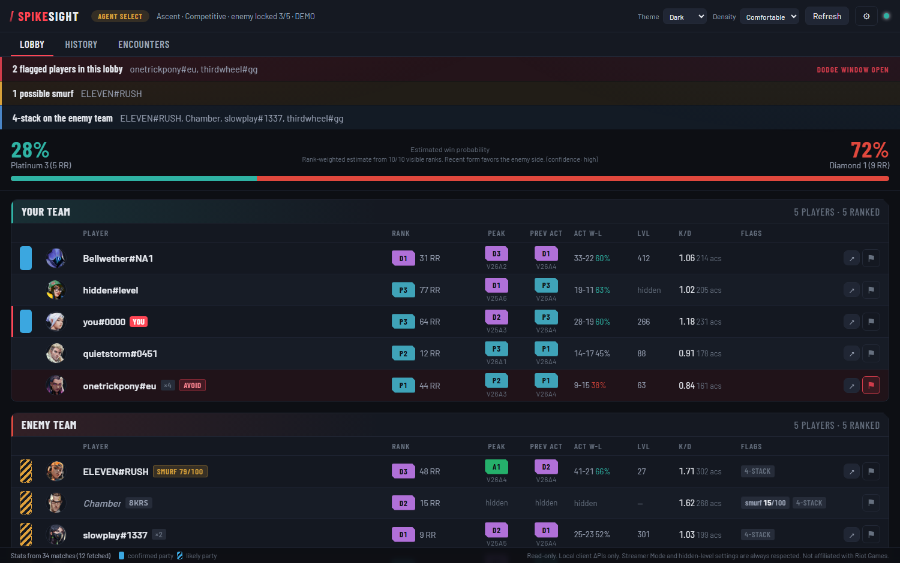
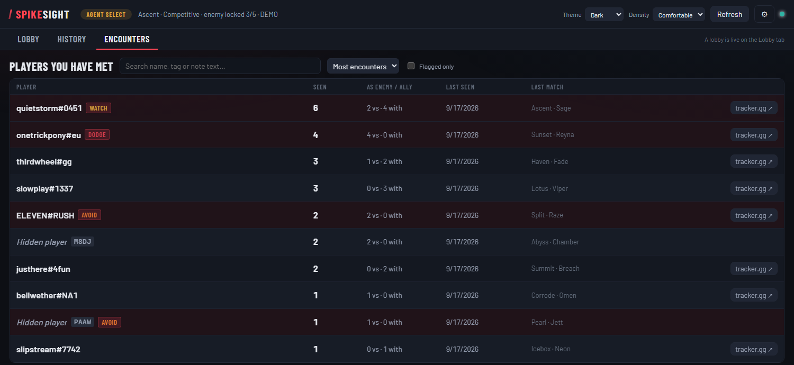
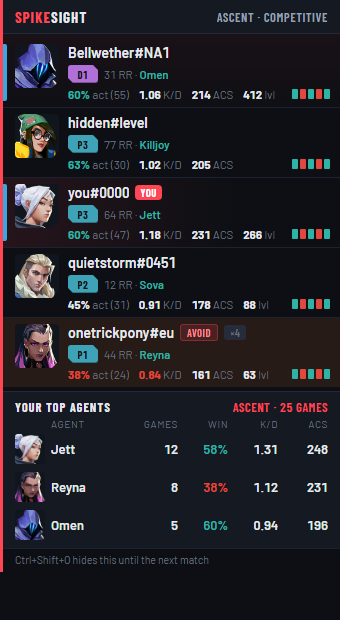
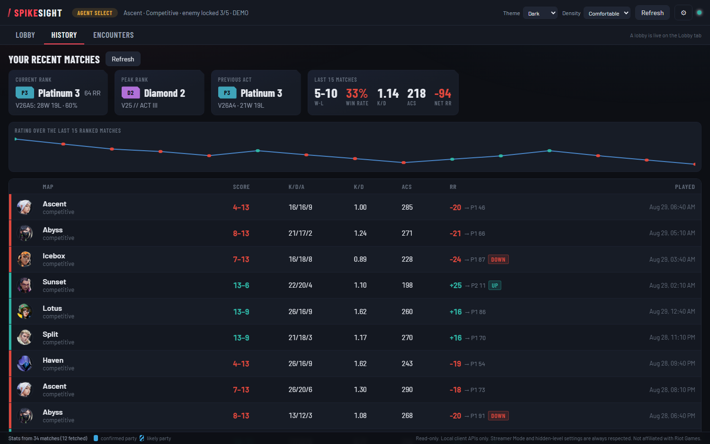
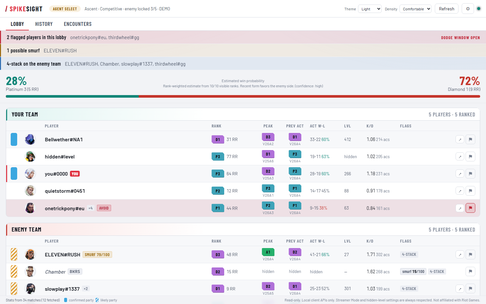

<div align="center">

# SpikeSight

**Know who you're playing with, before the match starts.**

A read-only VALORANT lobby scout for Windows. Ranks, peak ranks, recent form,
party detection, smurf flags, and a private record of players who ruined your
game — on screen the moment agent select loads, while dodging still costs you
nothing.

</div>



---

## What it does

The moment you load into agent select, SpikeSight shows you the lobby:

- **Everyone's rank and RR**, sorted so the lobby reads at a glance, with
  leaderboard placement for Radiant players.
- **Peak rank and the act they hit it in**, plus last act's rank and win-loss.
  A Diamond who peaked Immortal two acts ago plays nothing like a Diamond who
  just got there.
- **Recent form** — K/D and average combat score over each player's last few
  matches in the mode you're queued into, not their lifetime stats.
- **Party detection** — who queued together, colour-coded, including 4- and
  5-stacks in the modes that allow them. Confirmed parties and likely ones are
  marked differently, because one is a fact and the other is an inference.
- **Smurf flags** — a score out of 100 from account level, recent K/D, peak
  rank and win rate. Hover it and it shows you the whole calculation rather
  than asking you to trust a number.
- **Estimated win probability** for your side, weighted by rank and recent
  form.

### Your own notes on players

Flag anyone as **Watch**, **Avoid** or **Dodge**, with tags and a note. Next
time they show up, the flag is on the board while the dodge window is still
open.



Every completed match is recorded, so you also get a running count of how many
times you've met someone and whether they were with you or against you. A
roster is only logged once the match actually starts — a lobby you dodged was
never an encounter.

Any player whose riot ID is visible has a one-click link out to their full
stats on tracker.gg, for when you want the deep dive. Players in Streamer Mode
get no link, because SpikeSight never resolves their name in the first place.

### The pre-match overlay



An optional panel over the game during agent select, with your team and your
best agents for the map you're about to play. It **cannot be clicked** — it is
click-through, so it can never swallow a click meant for the agent grid — and
it disappears when the match starts. Drag it wherever you want it.

Needs VALORANT in **Windowed Fullscreen**; exclusive fullscreen draws over
everything. Off by default.

### Your own match history



RR gained and lost per match, the rank you landed on, K/D/A, ACS, and a rating
graph over your recent ranked games.

### And light mode



---

## Is this safe to use?

**Short version:** SpikeSight only ever *reads*, and only from the same local
APIs your own Riot Client already exposes on your machine. There is no code
path in it that can play the game for you.

That said — read this section rather than taking the summary on faith. It is
your account.

### What it does

| | |
|---|---|
| **Reads only** | Every request is a `GET`, with one exception: the batched name lookup Riot only exposes as a `PUT`. It has no side effects — the list of player ids is the query. |
| **Local APIs** | It authenticates with the tokens your Riot Client already minted for you, read from the lockfile on `127.0.0.1`. Your password never touches it, and there is no login flow. |
| **No injection** | Nothing is injected into VALORANT. No game memory is read or written. No DLLs, no hooks, no overlay drawn inside the game process. |
| **No automation** | It cannot queue, dodge, hover, lock an agent, send a message, join a party, or change any setting on your account. Not "it doesn't" — there is no function that does it. |
| **No input simulation** | It never moves your mouse or presses keys. The one keyboard shortcut is registered with Windows the normal way; it is not a keyboard hook and sees nothing else you type. |
| **Stays local** | No telemetry, no accounts, no server. Your notes are a SQLite file in `%LOCALAPPDATA%\SpikeSight`. Nothing is uploaded anywhere, by anyone, ever. |

### It respects other players' privacy settings

Riot's per-player privacy flags are enforced in the backend, before the data
reaches the screen — a hidden value is never sent to the UI at all, rather
than hidden with CSS:

- **Streamer Mode** — the riot ID is never even requested from Riot, never
  displayed and never written to disk. The player is shown by agent, with a
  short local code so your own notes can still tell two of them apart. The one
  exception is somebody in your own party, whose name your client already
  handed you.
- **Hidden account level** — not shown, and excluded from smurf scoring. It is
  *not* reconstructed from match history, which would defeat the setting.
- **Hidden act rank badge** — peak rank and previous act are suppressed.
- **Anonymised leaderboard placement** — suppressed.

### The honest caveat

Riot does not publish an approved-tools list, and does not vet third-party
apps. Nobody can promise you that any tool is endorsed, including this one.
What can be said concretely is that SpikeSight does none of the things Riot's
rules actually name — no automation, no injection, no interference with the
game — and that it does nothing the official client doesn't do already.

Use it at your own risk, as you would any third-party tool. If that risk isn't
one you want, don't use it. That's a completely reasonable position.

---

## Free, and staying that way

- **No ads. Ever.** Not in the app, not in the overlay, not anywhere.
- **No premium tier, no subscription, no "pro" unlock.** Everything it does,
  it does for everybody. There is no paid version to upsell you to, and there
  never will be.
- No account to make, no telemetry, nothing about you to sell.

If it saved you from a bad game and you feel like buying me a coffee, there's
a **Sponsor** button at the top of this page. Entirely optional — nothing in
the app is gated behind it, and nothing ever will be.

---

## Install

1. Download the latest `SpikeSight-x.y.z-windows.zip` from
   [Releases](../../releases).
2. Unzip it anywhere — Desktop, Documents, wherever.
3. Start VALORANT (or at least the Riot Client).
4. Run `SpikeSight.exe`.

Queue up. The board fills itself in.

**Windows will probably warn you.** A blue "Windows protected your PC" box
appears for any program without a paid code-signing certificate. Click
**More info** → **Run anyway**. See [Verifying the download](#verifying-the-download)
if you'd rather check first.

**To uninstall**, delete the folder. Nothing is written to Program Files, and
the only registry entry is the optional "start with Windows" one, which is
removed when you turn it off.

---

## Options

All off by default unless noted:

| | |
|---|---|
| **Pre-match overlay** | The panel over the game during agent select, on either side or dragged anywhere. |
| **Minimize after agent select** | Hides the window when the match starts. Worth it if you'd rather have the frames: in Windowed Fullscreen any visible window stops the game drawing straight to the screen. |
| **Minimize / close to the notification area** | Keeps SpikeSight running by the clock instead of quitting. |
| **Start with Windows** | One entry under your own user account. No admin rights, no service, no scheduled task. |
| **Theme** | Dark, Light, or follow Windows. |
| **Density** | Compact, Comfortable or Large. |
| **Fetch recent-match stats** | Powers the K/D column and part of the smurf score. Turning it off makes SpikeSight much lighter. |

---

## Does it affect performance?

It shouldn't, and there's a **Performance** section in the settings panel that
shows the settings which actually decide that — your display mode, refresh
rates and frame limits — along with a test to find out.

SpikeSight draws its window on the processor and doesn't touch your graphics
card, specifically so it can't take frames from the game. It uses about 1% of
one CPU core.

If your frame rate does drop with *any* window open over the game, that's
Windows composing the desktop instead of letting the game draw straight to the
screen — it happens with browsers and chat apps too. Minimizing is the fix,
and the option above does it for you.

---

## Verifying the download

Releases include a `SHA256SUMS.txt`. Check the file you downloaded matches:

```powershell
Get-FileHash .\SpikeSight-2.1-windows.zip -Algorithm SHA256
```

Every release is also scanned by [VirusTotal](https://www.virustotal.com); the
report is linked in the release notes.

**A note on antivirus warnings.** Unsigned apps built with PyInstaller get
flagged by heuristics fairly often — a self-extracting Python runtime looks
structurally like packed malware to a scanner that only sees the shape. If you
get a hit and want certainty rather than reassurance, the source is right here:
read it, and [build it yourself](#building-it-yourself).

---

## Building it yourself

Requires Python 3.11+ on Windows.

```powershell
git clone https://github.com/spikesight/spikesight-app.git
cd spikesight-app
python -m venv .venv
.\.venv\Scripts\pip install -r requirements.txt
.\.venv\Scripts\python -m spikesight
```

To build the same `.exe` the releases ship:

```powershell
.\.venv\Scripts\python tools\build_exe.py
```

Run the tests:

```powershell
.\.venv\Scripts\python -m unittest discover tests
```

There's a demo mode with synthetic data that makes no requests to Riot at all —
handy for looking around, and what the screenshots above were taken from:

```powershell
.\.venv\Scripts\python -m spikesight --demo
```

---

## Not affiliated with Riot Games

SpikeSight isn't endorsed by Riot Games and doesn't reflect the views of Riot
Games or anyone officially involved in producing or managing Riot Games
properties. Riot Games and all associated properties are trademarks or
registered trademarks of Riot Games, Inc.

## License

[MIT](LICENSE).
